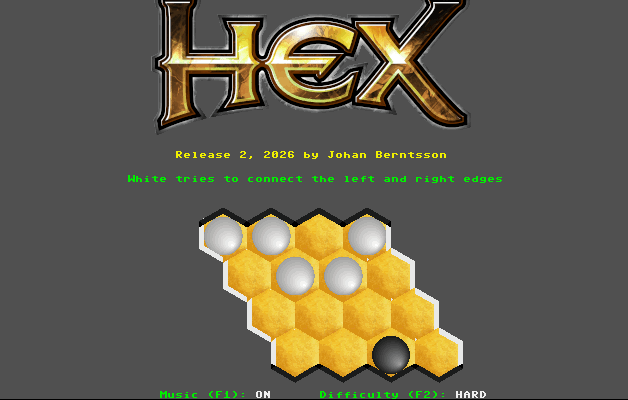

# hexgame
The Hex game for the MEGA65 computer, with an AI using Monte Carlo simulation and some heuristics.



# Getting started

**It is one file.** `release/hexgame.prg` is the whole game -- program, tune,
sound effects and tile sheet -- and it needs no disk. Put it on the SD card of
a real MEGA65 and run it, or:

    > xemu-xmega65 -prg release/hexgame.prg

Press **ESC** on the title screen to quit back to BASIC.

It used to be a D81 with an `autoboot.c65` and a `hexgame.fci` on it. The two
of them are 94 KB, which does not fit in a 6502's address space at once;
[exomizer](https://bitbucket.org/magli143/exomizer/wiki/Home) makes them 39 KB,
which does, and a small unpacker at the front of the file puts them where they
belong. See `tools/mkprg.py` and `src/stage1.c`.

# Compiling and building

The game is built with the [Calypsi 6502 tool
chain](https://github.com/hth313/Calypsi-tool-chains), version 5.18 or later,
which needs `cc6502`, `as6502` and `ln6502` on your `PATH`. You will also need:

- **exomizer** on your `PATH`, which compresses the two halves of the file
- [Xemu](https://github.com/lgblgblgb/xemu) for `xemu-xmega65`, to run it

```sh
make            # build build/hexgame.prg
make run        # build it and boot it in the emulator
make game       # boot the game on its own, without the unpacker in front
make release    # copy the built file over release/hexgame.prg, the one checked in
make clean
```

`c1541` from VICE used to be needed, to write the D81. It is not any more.

Two more tools are needed only when an asset changes, and both are checked in
already built, so an ordinary build never calls them:

- **pypng** (`pip install pypng`), for `tools/png2fci.py`, when
  `img-src/hexgame.png` changes. See `assets/tile/readme.txt` for how the tile
  sheet is assembled and why it has to be reduced to 239 colours by hand.
- **acme**, when the music changes — and only to check it. The tune and its
  player live in `music/` as ACME sources and are translated into the Calypsi
  assembler by `tools/acme2calypsi.py`, which needs nothing but Python;
  `make checkmusic` assembles the same source both ways and compares the
  bytes.

It used to be built with cc65 driven by scons, which is what most of the code
was written against. The port is [described below](#porting-from-cc65).

# Notes

The game is based on the mega65_libc, especially fcio.c for full color
graphics, but I've extended the library to allow tile blitting with
transparancy to allow overlapping bitmaps.

The computer player has three levels, and they are a real ladder — the numbers
are 400 games a side from `tools/hexsim`, which plays the shipping AI against
itself on a PC:

| black \ white | random | easy | normal | hard |
|---|---|---|---|---|
| **easy**   | 88% | 47% | 29% | 1% |
| **normal** | 97% | 68% | 50% | 5% |
| **hard**   | 100% | 98% | 95% | 47% |

*White moves first, which in Hex is worth a few points — hence 47% rather than
50% along the diagonal.*

**Easy** plays a random empty tile behind a couple of blocking heuristics.
**Normal** is the Monte Carlo search the game was written around: take the
empty tiles, shuffle them, fill the board, see whether black ended up with a
connection, and repeat. It works, but twenty random fills of a 9x9 board is far
too few for the answer to mean much, and a MEGA65 cannot afford twenty
thousand.

**Hard** asks a question that has an exact answer instead: *how many more
stones would each side need?* Give every cell a cost for one colour — nothing
if that colour already has a stone there, one if it is empty, unreachable if
the opponent holds it — and the cheapest path between that colour's two edges
is the number of stones it still has to place. Four such distance fields, one
from each edge of the board, score every empty cell at once: a cell on a short
path for black is worth taking, and a cell on a short path for white is worth
taking away. Play the cell that is most of both, block anything that would let
white finish next move, and finish yourself when you can.

That is not a deep search — it has no idea what the opponent will reply — but
it understands the shape of the board in a way that random fills do not, and it
is **far cheaper** than what it replaced: four sweeps over 81 cells for a whole
move, against twenty board fills for each of up to 81 candidate moves. The old
hard level thought visibly. This one does not, and beats it 90% of the time
from either seat.

A min-max or Monte Carlo *tree* search would be stronger still, and knowing
what the opponent replies is what this cannot do. That one is left as an
exercise to the reader :)

See [design.md](design.md) for more information.

Feedback and pull requests are always welcome and appreciated.

# Credits

This game uses tools/diskutil.rb, which was written by Fredrik Ramsberg.
