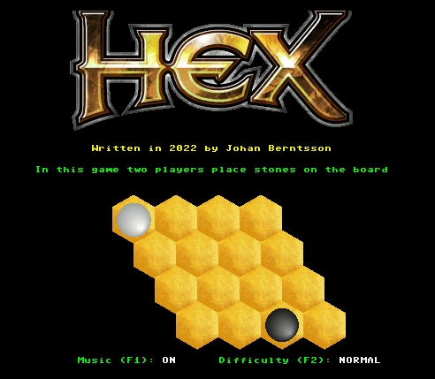

# hexgame
The Hex game for the MEGA65 computer, with an AI using Monte Carlo simulation and some heuristics.

See [design.md](design.md) for more information.

# Getting started

Run the hexgame.d81 file in an emulator or on a real MEGA65.

A typical command to start the emulator is:

    > xemu-xmega65 -8 disc/hexgame.d81 

# Compiling and building

You need to install the cc65 compiler. scons is also needed
    > sudo apt install scons

pypng is needed for converting new graphics
    > sudo apt install python3-pip
    > pip install pypng

Build with "make". 

