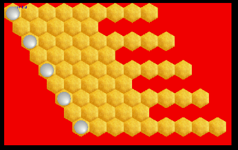
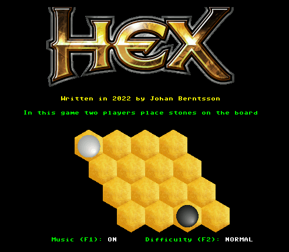

# **HEX GAME**

_Written by Johan Berntsson_

- 10 January 2022: started development

# Introduction

I'm trying to make a colourful and interesting game for the MEGA65.

I wanted to write a game with hexagons with nice graphics, because hexagons are difficult to make on a C64, but should be possible to do on a MEGA65. I decided to implement Hex, which is a is a two player abstract strategy board game in which players attempt to connect opposite sides of a hexagonal board. Hex was invented by mathematician and poet Piet Hein in 1942 and independently by John Nash in 1948.

# Programming Languages

At first I tried different approaches and looked for code samples to get a grip on MEGA65 programming.

## Basic10

It is not a nice experience, going back to 2 byte variable names and line numbers. Basic 10 is of course much better than basic 2, but still not pleasant. Furthermore, the hires graphics is bitplane-based, and the memory available is limited to the first 128 KB. This means that I cannot even open a full sizes screen with 256 colors - this crashes the computer. At lower resolutions I can draw graphics, but it is noticeably slow to draw lots of lines or make fills. Even in 40 MHz mode.

## Assembler

Both Acme and KickAssembler have support for the 4510 processor, and there are some code examples on the net. It is quite feasible to write program in assembler, but it comes with lots of book-keeping, especially when working with graphics in other memory banks. I prefer to work on a slighly higher level and decided to go for C instead.

## C

I tried cc65 and KickC. KickC is creating the better code, but it is buggy and I was not even able to compile all mega65 examples supplied with it. For this reason I decided to use cc65 for now. It produces bloated code (just look at the produced assembler code!) but it seems rock steady. Once the game is working and KickC is improving I'll try to port it back.

# Graphics

## C64 graphics

MEGA65 still supports all C64 graphics modes, but why limit yourself when doing a MEGA65 game? I want something that looks more like an Amiga game than yet another C64 game.

## Bitplane graphics

This is the hires supported by the original C65. It is limited to the first 128 KB and poorly supported (at least I don't find much in terms of tutorials, libraries, or examples).

## VIC-IV full colour mode

VIC-IV offers new character modes instead of the VIC-III's bitplane mode. This normally provides many benifits such as:
- less memory consumption, since repeated elements (such as tiles in an arcade game) are just characters in the screen memory, instead of having to be copied pixel by pixel into a bitplane or bitmap.
- faster scrolling, since only the screen memory has to be adjusted instead of having to move all pixels in a bitplane or bitmap

Full color mode is one of the new character modes. In full color mode each pixel has 8 bits, which acts as a pointer to a palette, giving up to 256 colours. 

The default memory configuration for fcio is:
$12000: 16 bit screen
$14000: bitmap graphics
$15000: system palette
$15300: loaded palettes
$40000: loaded bitmaps

## Raster Rewrite

# Memory Layout

The available memory on a MEGA65 is fast chip ram, attic ram and colour ram.

Fast chip ram is 348 KB of memory available to available to VIC-IV for graphics (is this true?), at location $0 to $5xxxx (bank 0 - 5). Extended or future models of MEGA65 may have more, but 384 KB is the guaranteed minimal amount. This memory is normally ised as follows:

| Address              | Bank | Comment                            |
|----------------------|------|------------------------------------|
| $00000000 - $0000ffff| 0    | like C64                           |
| $00010000 - $00011fff| 1    | CBDOS (internal floppy & SD-card)  |
| $00012000 - $0001ffff| 1    | free                               |
| $00020000 - $0003ffff| 2, 3 | C64 and C65 ROM (can be banked out)|
| $00040000 - $0005ffff| 4, 5 | free                               |

The lower 8K segment of bank1 $10000 - $11FFF is used by CBDOS for buffers and variables.
CBDOS is used in C64 mode too for access to the internal floppy drive and the SD-card images.

In addtion there is normally 8 MB of attic ram at $08000000 – $087FFFFF, which is not available to VIC-IV for graphics (is this true?), and 32 KB of colour RAM at $0ff80000 - $0ff87fff.

## First attempt

In my first attemt I tried to use full color mode in combination with raster rewrite to handle irregular shapes.

The problem with hexagons is the overlap at the edges, and since full color mode is character based, I will overwrite parts of the first hexagon when I try to put another next to it. I thought I had a solution by using the raster rewrite buffer (rrw). I would then add every second row of hexagons on the screen as usual, and add the remaining lines to the rrw. However, I found that adding to much in the rrw will crash the computer. I think it is because I run out of time for each
raster when I add to many characters to write. So this approach is useful, but not good enough for the type of game I want to write.

On the other hand I made a nice rrw extension to fcio in the C stdlib.

# Second Attempt

I decided to use unique tiles for each character instead, so that I could then merge/overwrite bitmaps to create the desired effect. For a 640 * 400 screen, with 80 * 50 characters, which is 80 * 50 * 64 = 256,000 bytes, or about 250 KB. I first planned to banking out the ROM at bank 2 and 3, using $12000-$1F7FF for assets and $2xxxx - $5ffff (262,144 bytes) for the character data. However, this would nuke the C64 kernal, and unless I permanently disable interrupts things will break. There is a way around this in this example [bmpview.c](https://github.com/MEGA65/mega65-tools/blob/master/src/examples/bmpview.c)

The kernal is located in 2e000 - 2ffff (8192 bytes), so if I leave this as is, then I have almost enough. If I just avoid putting a bitmap in the bottom right corner of the display I'll be fine.

# Music

I wanted to add music so I picked a SID file from [High Voltage SID Collection](https://www.hvsc.c64.org/). If needed the SID can be relocated using the sidreloc utility. I have available space at $c000, so I relocate with -p c0:

    sidreloc -r 10-1f -p c0 model.sid music.sid

I then convert the SID to a prg file with psid64.

    psid64 -n music.sid

The init and play addresses can be inspected with

    sidplay -v music.sid

# Improvements

