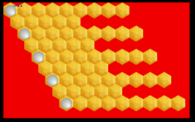
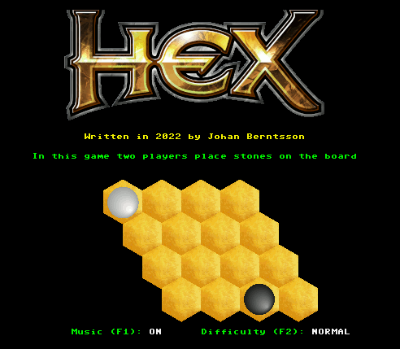

# **HEX GAME**

_Written by Johan Berntsson_

- 10 January 2022: started development
- 19 August 2026: new version with better AI and mouse support, build with Calypsi C
- 26 August 2026: new sound, rewritten as an PRG file with exomzier

# Introduction

I'm trying to make a colourful and interesting game for the MEGA65.

I wanted to write a game with hexagons with nice graphics, because hexagons are difficult to make on a C64, but should be possible to do on a MEGA65. I decided to implement Hex, which is a is a two player abstract strategy board game in which players attempt to connect opposite sides of a hexagonal board. Hex was invented by mathematician and poet Piet Hein in 1942 and independently by John Nash in 1948.

# Programming Languages

At first I tried different approaches and looked for code samples to get a grip on MEGA65 programming.

## Basic10

It is not a nice experience, going back to 2 byte variable names and line numbers. Basic 10 is of course much better than basic 2, but still not pleasant. Furthermore, the hires graphics is bitplane-based, and the memory available is limited to the first 128 KB. This means that I cannot even open a full sizes screen with 256 colors - this crashes the computer. At lower resolutions I can draw graphics, but it is noticeably slow to draw lots of lines or make fills. Even in 40 MHz mode.

## Assembler

Both Acme and KickAssembler have support for the 4510 processor, and there are some code examples on the net. It is quite feasible to write program in assembler, but it comes with lots of book-keeping, especially when working with graphics in other memory banks. I prefer to work on a slighly higher level and decided to go for C instead.

## C

I tried cc65 and KickC. KickC is creating the better code, but it is buggy and I was not even able to compile all mega65 examples supplied with it. For this reason I decided to use cc65 for now. It produces bloated code (just look at the produced assembler code!) but it seems rock steady. Once the game is working and KickC is improving I'll try to port it back.

# Graphics

## C64 graphics

MEGA65 still supports all C64 graphics modes, but why limit yourself when doing a MEGA65 game? I want something that looks more like an Amiga game than yet another C64 game.

## Bitplane graphics

This is the hires supported by the original C65. It is limited to the first 128 KB and poorly supported (at least I don't find much in terms of tutorials, libraries, or examples).

## VIC-IV full colour mode

VIC-IV offers new character modes instead of the VIC-III's bitplane mode. This normally provides many benifits such as:
- less memory consumption, since repeated elements (such as tiles in an arcade game) are just characters in the screen memory, instead of having to be copied pixel by pixel into a bitplane or bitmap.
- faster scrolling, since only the screen memory has to be adjusted instead of having to move all pixels in a bitplane or bitmap

Full color mode is one of the new character modes. In full color mode each pixel has 8 bits, which acts as a pointer to a palette, giving up to 256 colours. 

The default memory configuration for fcio is:

- $12000: 16 bit screen
- $14000: bitmap graphics
- $15000: system palette
- $15300: loaded palettes
- $40000: loaded bitmaps

This memory is normally used by the Basic in C65 mode:

- 1600 - 17ff:  currently unused
- 1800 - 1bff:  buffer for PAINT, GCOPY, CUT, PASTE
- 1c00 - 1cff:  clipping variables
- 1d00 - 1dff:  buffer for IFF load/save and CHAR
- 1e00 - 1eff:  scanline buffer (graphics)
- 1f00 - 1fff:  direct page for graphic routines

## Raster Rewrite

# Memory Layout

The available memory on a MEGA65 is fast chip ram, attic ram and colour ram.

Fast chip ram is 348 KB of memory available to available to VIC-IV for graphics (is this true?), at location $0 to $5xxxx (bank 0 - 5). Extended or future models of MEGA65 may have more, but 384 KB is the guaranteed minimal amount. This memory is normally ised as follows:

| Address              | Bank | Comment                            |
|----------------------|------|------------------------------------|
| $00000000 - $0000ffff| 0    | like C64                           |
| $00010000 - $00011fff| 1    | CBDOS (internal floppy & SD-card)  |
| $00012000 - $0001ffff| 1    | free                               |
| $00020000 - $0003ffff| 2, 3 | C64 and C65 ROM (can be banked out)|
| $00040000 - $0005ffff| 4, 5 | free                               |

The lower 8K segment of bank1 $10000 - $11FFF is used by CBDOS for buffers and variables.
CBDOS is used in C64 mode too for access to the internal floppy drive and the SD-card images.

In addtion there is normally 8 MB of attic ram at $08000000 – $087FFFFF, which is not available to VIC-IV for graphics (is this true?), and 32 KB of colour RAM at $0ff80000 - $0ff87fff.

## First attempt

In my first attemt I tried to use full color mode in combination with raster rewrite to handle irregular shapes.

The problem with hexagons is the overlap at the edges, and since full color mode is character based, I will overwrite parts of the first hexagon when I try to put another next to it. I thought I had a solution by using the raster rewrite buffer (rrw). I would then add every second row of hexagons on the screen as usual, and add the remaining lines to the rrw. However, I found that adding to much in the rrw will crash the computer. I think it is because I run out of time for each
raster when I add to many characters to write. So this approach is useful, but not good enough for the type of game I want to write.

On the other hand I made a nice rrw extension to fcio in the C stdlib.

# Second Attempt

I decided to use unique tiles for each character instead, so that I could then merge/overwrite bitmaps to create the desired effect. For a 640 * 400 screen, with 80 * 50 characters, which is 80 * 50 * 64 = 256,000 bytes, or about 250 KB. I first planned to banking out the ROM at bank 2 and 3, using $12000-$1F7FF for assets and $2xxxx - $5ffff (262,144 bytes) for the character data. However, this would nuke the C64 kernal, and unless I permanently disable interrupts things will break. There is a way around this in this example [bmpview.c](https://github.com/MEGA65/mega65-tools/blob/master/src/examples/bmpview.c)

The kernal is located in 2e000 - 2ffff (8192 bytes), so if I leave this as is, then I have almost enough. If I just avoid putting a bitmap in the bottom right corner of the display I'll be fine.

# Music

I wanted to add music so I picked a SID file from [High Voltage SID Collection](https://www.hvsc.c64.org/). If needed the SID can be relocated using the sidreloc utility. I have available space at $c000, so I relocate with -p c0:

    sidreloc -r 10-1f -p c0 originalmusic.sid music.sid

Look out for warnings! If sidreloc says that there are references out of
range, then these will not be converted and will probably overwrite
your program later on, leading to hard-to-track-down bugs. I speak from
experience.

I then convert the SID to a prg file with psid64.

    psid64 -n music.sid

The init and play addresses can be inspected with

    sidplay -v music.sid

**The tune moved off $C000 in 2026.** That address was free because the game
was a C64 mode program launched from a wrapper; the Calypsi build is a C65 mode
program and $C000-$CFFF is the C65's interface ROM. It was relocated to $9000
instead, into a hole `mega65-hexgame.scm` held back above the program.

**And then it stopped being a SID file at all (Aug 2026).** Everything above
describes a tune that is somebody else's binary: a block of 6502 with an init
and a play address, relocated by a tool that has to be told which addresses it
may move and which zero page bytes it may have, loaded off the disk at a fixed
address that the linker then has to be kept out of. Three files had to agree
about $9000 and $7C-$7F — the sidreloc invocation, the linker script and
`src/music_irq.s` — and none of them could check the other two.

The music is now an ACME source: `music/player.asm` is a small three voice
player and `music/gambit.asm` is the song, both written rather than lifted.
`tools/acme2calypsi.py` translates them into the Calypsi assembler and the
result is **linked into the program** like any other object, so:

- there is no `MUSIC.PRG` on the disk and no load to get wrong;
- there are no addresses to keep in step. `music_init` and `music_play` are
  symbols the linker places, and the player's two zero page pointers are a
  `zzpage` bss section it places too;
- the program area goes back to $2001-$9FFF and zero page back to $7F, which is
  where the 4 KB and the four bytes the old scheme cost show up again. Player
  and tune together are 3045 bytes, so it is about 1 KB ahead;
- the one ordering rule got shorter. The tune used to be one of the things
  `load_resources()` had to read before the memory map was flattened; now the
  only thing that happens is `music_init(0)` beside `music_install()`, after.

**The sample sound effects went the same way (Aug 2026).** The click when a
stone goes down and the buzz when you aim at a hexagon that is taken were 8 bit
samples played through the MEGA65's audio DMA: `res/marba.wav` and
`res/downlead.wav`, 7500 and 6014 bytes, loaded into chip RAM at $16000 and
$18000 and started with two dozen POKEs into $D720. They are twelve pairs of
bytes in `music/sfx.asm` now, played on the SID by the player that was already
there. Taking `play_sample()` and the two loads out paid for the effects engine
twice over: the program is 243 bytes smaller than it was before any of this,
and the disk lost 13.5 KB.

The interesting part is that the SID has three voices and the tune uses all
three, so an effect **borrows one**. `sfx_owner` names the voice for as long as
one is playing and the player skips the five places it would write that voice's
registers — while going on tracking its pattern, arpeggio and slide exactly as
before, so nothing drifts out of time. The bass is the voice lent out, because
it is a pluck that has mostly decayed by the time an effect is over; the harp
is the tune's engine and the melody is the tune.

Two things about the SID had to be respected and are the reason this took more
than an afternoon. An envelope triggers only on a 0 → 1 edge of the gate bit,
so an effect landing on a voice the tune left gated on gets no attack at all —
and raising the sustain level during the sustain phase does not raise the
envelope, it drains it. So an effect spends its first frame doing the same hard
restart the player does before every note, and opens the gate on the second.
That is 40 ms of latency on a click, which nobody notices, and the difference
between a sound and silence.

They also play now with the music on, which the samples never did.

The converter is the part that could be quietly wrong, so it is checked rather
than trusted: `make checkmusic` assembles `music/player.asm` with ACME and with
Calypsi at the same origin, pins the linker's zero page to the addresses the
ACME source picked, and compares the two images byte for byte. Both tools and
the argument for them came from `~/commodore/SearchAndRescue`, which runs the
same player under a different song.

# One file, and no disk

**August 2026.** The game shipped as a D81 with two files on it: `autoboot.c65`,
which the MEGA65 ROM boots by name, and `hexgame.fci`, the 64 KB tile sheet it
read at startup. That is a reasonable thing for a MEGA65 program to be and it is
not what an 8 bit game usually was -- a game was a file, you loaded it, it ran.

The two of them are 94 KB. A 6502 has 64 KB of address space, so the reason the
disk existed at all is that the tile sheet could not be in the program: it had
to be read in and DMAd up to attic RAM at run time. Compressed with exomizer --
and with the file I/O taken out of the program, which was worth 2.7 KB on its
own -- the pair comes to 35 KB of stream, and *that* fits, with most of the map
left over to unpack into. So `hexgame.prg` is now the whole thing: 41 KB, one
file, no disk, no `c1541` in the build.

## What exomizer will and will not do

Worth writing down first, because it is the constraint the whole design is
shaped around: **exomizer's `sfx` and `mem` sub-commands live inside a 16 bit
address space.** They cannot decrunch to `$40000`, let alone to attic RAM at
`$8000000`, because a 6502 decruncher writes through a 16 bit pointer and that
is all there is. So the two halves of this file are two different problems and
the usual advice is to treat them differently:

- **`game.prg`, auto-running code** is what `exomizer sfx` is for. It wraps the
  program in its own BASIC stub and decruncher and jumps to an entry point.
  `exomizer sfx sys game.prg` reads the SYS out of the BASIC line, though on a
  C65 the line is at `$2001` rather than `$0801` and the safer form is to give
  the address outright -- `exomizer sfx 0x200e ...`. `-n` turns off the
  decrunch flicker, which looks wrong on a MEGA65.
- **`hexgame.fci`, a passive blob**, is what `exomizer mem` is for:
  `exomizer mem hexgame.fci@0x9000` picks a load address for the compressed
  bytes that overlaps the destination safely and decrunches backwards in place.
  Then you move it where it really goes, and since `$8000000` is not a CPU
  address that means DMA -- `lcopy(0x9000, 0x8000000, len)` out of mega65-libc,
  which builds an F018 job list and is the standard way across the boundary.

**Neither of those is what this ended up doing**, and the reason is the size of
the tile sheet. `mem` decrunches a whole blob to one place, and the blob is
64000 bytes: there is no 64000 byte hole in the map to stage it in, so it would
have had to be split into a dozen separately crunched chunks, each decrunched to
a scratch buffer and DMAd up. That works and it is what the notes above assume.
It is also a lot of moving parts, and it costs compression, because every chunk
restarts the encoder.

The streaming decruncher removes the whole problem -- see below. What survives
from the reconnaissance is `exomizer raw`, which is neither `sfx` nor `mem`: a
bare stream with no load address, no decruncher stapled to the front and no
opinion about where the bytes go. Two of those and one stage 1 that knows what
to do with both is a smaller thing than two different mechanisms.

The other road not taken was **`MAP`**: bank a window of chip RAM into the
CPU's address space and let the decruncher write to `$8000` believing it is
ordinary memory, with no DMA copy at all. It is a real technique and it is
fiddlier than it sounds -- you have to unmap afterwards and be careful about
zero page and the stack while the window is open -- but the thing that ruled it
out here is simpler than any of that: `MAP`'s offset reaches the first megabyte,
and attic RAM starts at `$8000000`. It could not have addressed this resource
at all.

## The shape of it

In `tools/mkprg.py`. What made it work:

- **the streaming decruncher.** Exomizer ships a C implementation as well as
  the assembly one, and it is a *streaming* decruncher -- it hands back one byte
  at a time out of a bounded back-reference window instead of filling a buffer.
  That is the whole design: the tile sheet is decrunched a kilobyte at a time
  and DMAd straight to attic RAM, so 64000 bytes never have to exist in the 64
  KB map at all. Compiling exomizer's own C rather than porting its assembler
  also meant not hand-translating a decompressor, which is the kind of code that
  is either exactly right or quietly wrong.
- **unpacking the game over its own compressed bytes.** The game decrunches to
  $2001 while it is being read from $70D8, so the write pointer is chasing the
  read pointer up the same memory. `mkprg.py` proves it cannot catch it, by
  walking the stream and comparing the two at every byte -- 11184 bytes of
  slack, printed on every build. Stage 1 itself sits at $B800, above everything
  it writes, so it survives long enough to jump into what it unpacked.
- **three things that were only true because the ROM was there.** This took
  most of the afternoon and all three had the same shape: something had been
  quietly relying on the C65 ROM, and booting from a stage 1 that banks it out
  first took the floor away.
  - stage 1's C stack was at $C122, and $C000-$CFFF is the interface ROM. `$01`
    does not control that -- $D030 bit 5 does, and nothing was clearing it. The
    first function call with a local variable in it had nowhere to put it and
    the machine simply stopped.
  - `fc_init` opened with a `puts` and two `BSOUT`s, tidying up a screen BASIC
    had been using. With no initialised KERNAL behind them they hung the
    machine on the first line of the program.
  - and taking the `BSOUT(14)` out cost the lower case character set, because
    that call was the only thing selecting it. Every capital letter came out as
    a graphic. `fc_screenmode` sets $D018 bit 1 itself now.

  None of the three is a bug in what was there before; all three are the cost
  of a program that used to start inside a running ROM and now starts on a bare
  machine.
- **it also made the program smaller.** No files means no `fopen`, which means
  no stdio: `loadExt`, `readExt` and two other file-taking functions came out of
  `fcio.c` and the program lost about 2.7 KB.

# Memory problems/fast IRQ loader

There is a fast loader which could be used to read the resouces in the mega65-tools repository: [fastload_demo.a](https://github.com/MEGA65/mega65-tools/blob/master/src/utilities/fastload_demo.asm)

Read this [blog post](https://c65gs.blogspot.com/2021/11/creating-simple-internal-drive-fast.html) for more information.

# Computer Opponent / AI

It is hard to make a good AI to the Hex game, esxpecially with a (relatively) weak machine as the MEGA65. Exhaustive search is out of the question, so I tried using Monte Carlo simulation.

## Random Moves

On the easy level the computer plays random moves, and it very easy to beat.

## Monte Carlo Simulation

Normal and hard levels try to implement a Monte Carlo simulation. It works by playing a series of games using the currently empty tiles and calculating the number of predicted wins for the computer. The computer then plays the stone with the most predicited wins. The problem is that I need to limit the number of randomized plays to keep the response time down to reasonable levels, which has a great impact on the quality of the AI player. So even the MCS player isn't very chanllening.

## Heuristics

To at least stop the worst stupid moves I combined the Monte Carlo simulation
with a few heuristics that try to block chains of the opponent when they get
long.

## Shortest connection (2026)

The hard level does not do any of the above any more. The Monte Carlo search
is still what the normal level plays, and it is still limited by the same
thing: a MEGA65 can afford about twenty random fills of the board per candidate
move, and twenty is nowhere near enough for the answer to mean anything.

The hard level asks a question with an exact answer instead. Give every cell a
cost for one colour -- nothing where that colour already has a stone, one where
the cell is empty, unreachable where the opponent holds it -- and the cheapest
path between that colour's two edges is exactly the number of stones it still
has to place. That is a shortest path problem on 81 cells with weights of only
0 and 1, which a 0-1 breadth first search solves in one sweep.

Four of those, one from each edge of the board, score every empty cell at once:
`top(c) + bottom(c) - 1` is the length of black's best connection *through* c,
and `left(c) + right(c) - 1` is white's. Take the cell that is smallest for
both, with two exceptions that outrank everything: play a cell that finishes
the game, and block a cell that would let the opponent finish next move.

It is worth being clear about what this does not do. It never considers a
reply, so it is not a search in the min-max sense at all -- it is a static
evaluation applied to every legal move. It has no idea about bridges or other
two-connections, which is what a strong Hex program is mostly made of. What it
does have is a picture of the whole board that is *correct* rather than
sampled, and that alone is worth about 90 points in 100 against the Monte Carlo
player it replaced, in a fraction of the time: four sweeps for a whole move,
against twenty board fills for each of up to 81 candidates.

`tools/hexsim` is what those numbers come from. It builds `src/hexboard.c` and
`src/hexgame_ai.c` with the host compiler and plays the AI against itself a few
hundred times a second, which is why the AI's board and rules are a separate
file from the game's screen handling now.

# Mouse, joystick and the arrow (2026)

The cursor used to be a fourth tile in `hexgame.fci` -- an arrow drawn inside a
hexagon, blitted over the board and moved a whole hexagon at a time by the
cursor keys. That is the one shape a mouse cannot have. It is a hardware
sprite now, and the mouse, a joystick and the keyboard all move the same one.

The mouse is a 1351 read straight from the MEGA65's own pot registers,
`$D620`/`$D621`, which need none of the SID and CIA multiplexing that reading
a mouse on a C64 does: the pot is a six bit counter that wraps, so a reading
only means anything as the signed difference from the last one. The button is
the fire line of *either* control port, because which physical port those pot
registers belong to is not the same in xemu as it is on the machine. All of
that, and the reason `$DC00` has to be read with the keyboard columns
deselected -- it is the column select as much as it is control port 2 -- comes
from `asm/mouse.asm` in my Ozmoo z6 branch, which is the version of this code
that has run on a real MEGA65. A joystick is the alternative for anyone
without a mouse, and moves the arrow one hexagon per step like a cursor key.

Two things about it were decided by looking at screenshots rather than at a
manual:

**A sprite pixel is not square here.** The screen is H640 and V400, so one
sprite unit is two screen pixels each way -- a monochrome sprite is 48x42 with
square pixels, but a *multicolour* one is four wide and two tall, and the
first attempt at a diagonal arrow came out looking like a flag. So the arrow
is monochrome, and it gets its black outline from a second monochrome sprite
of the same shape grown by a pixel, sitting behind it. Sprite 0 is the body,
sprite 1 the outline, and the lower numbered sprite is in front.

**The sprite pointers had to move.** The VIC-IV reads them from the screen
base plus `$3F8`, and the screen here is 16 bit full colour characters at
`$12000`, so that address is a character on the board. `SPRPTRADR`
(`$D06C`-`$D06E`) relocates the list, and bit 7 of its top byte asks for 16
bit pointers -- each one an address divided by 64, which is why the two
shapes are copied into a 64 byte aligned window of a plain C array.

The pointer itself is not a position on the screen. It is *which hexagon, and
how far into it*: four bytes, two of them signed. A step to the next hexagon
is a subtraction rather than a division, which is not a detail -- the first
version tracked a 16 bit screen pixel, and the divisions and multiplications
that needed cost 1.3 KB in a program area that had about 300 bytes left.
Rounding to a row and then to a hexagon within it makes the region that picks
a hexagon a rectangle rather than the hexagon itself, so its four corners
belong to the neighbour they touch; nobody aims there.

That still did not fit, and what made room was moving `zdata` -- all 1.5 KB of
the program's BSS -- into the free RAM at `$1600-$1EFF` that the Calypsi
linker rules already declare and that this program was not using. It is below
the program, so it is not in the PRG and nothing has to load it; the disk
loading in `load_resources()` runs with it live and the C65 KERNAL has left it
alone. The program area went from 98.9% full to 97.4% with the whole feature
in it.
